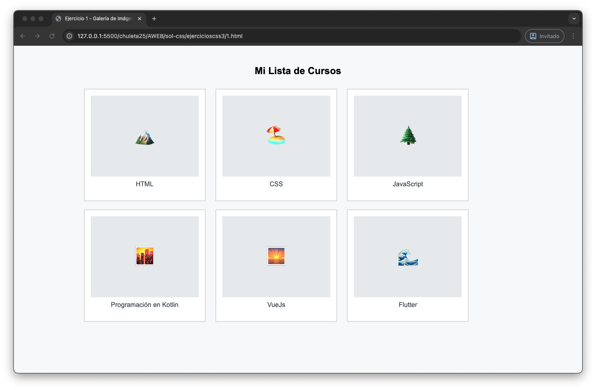
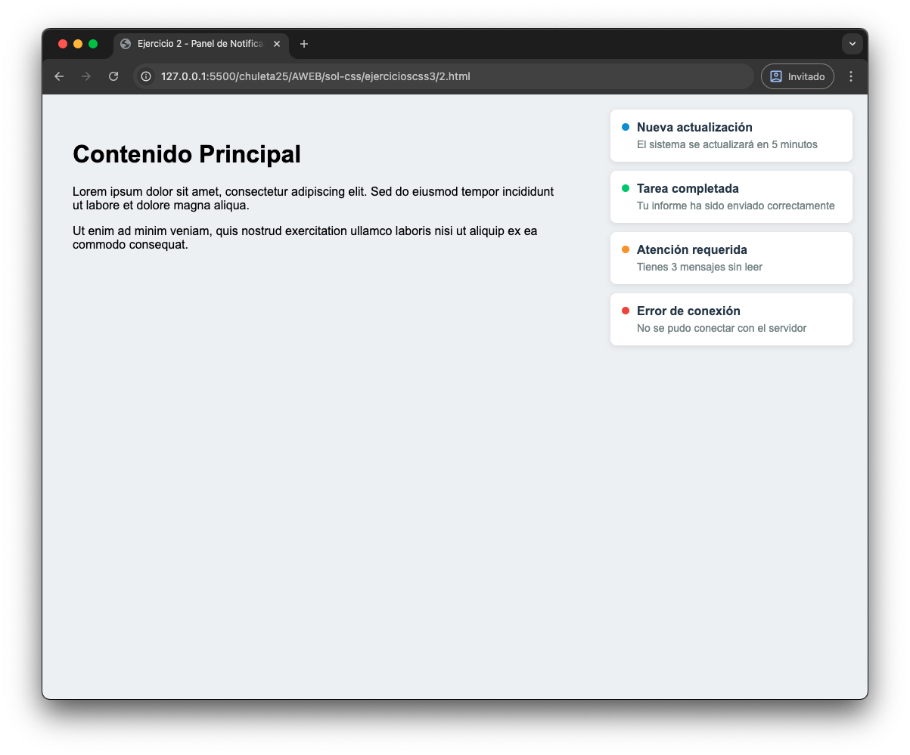
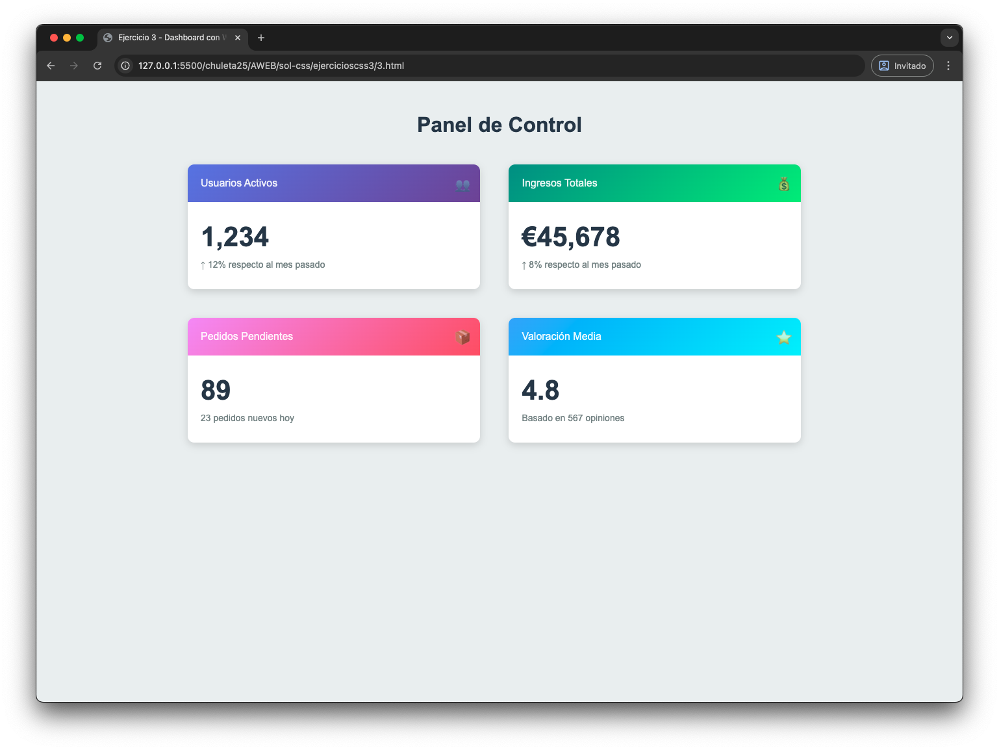
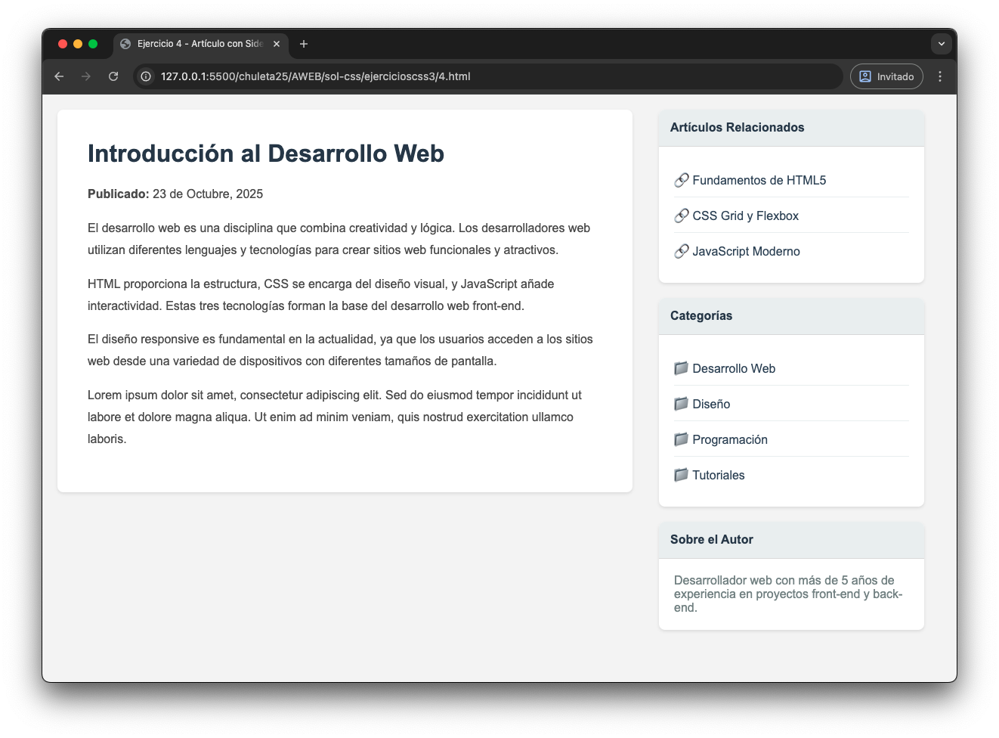
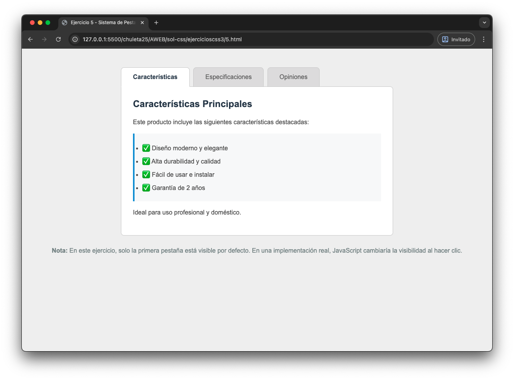
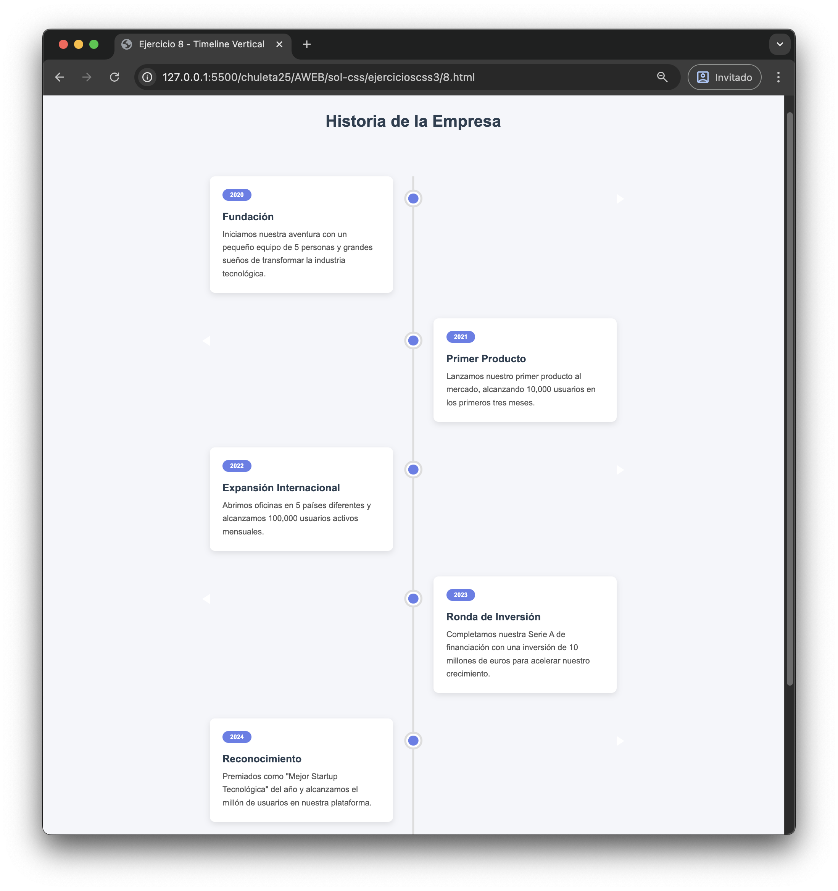

# Ejercicios CSS - parte 4

En esta carpeta encontraremos el codigo delos ejercicios de CSS que deberás copiarte en tu visual studio code para resolverlos. Están enlos archivos 1.html, 2html, 3.html 4.html, 5.html, 6.html, 7.html y el 8.html Debes seguir los pasos indicados para obtener los siguientes resultados:

## Ejercicio 1

## Ejercicio 2

## Ejercicio 3

## Ejercicio 4

## Ejercicio 5

## Ejercicio 6

## Ejercicio 7

## Ejercicio 8

